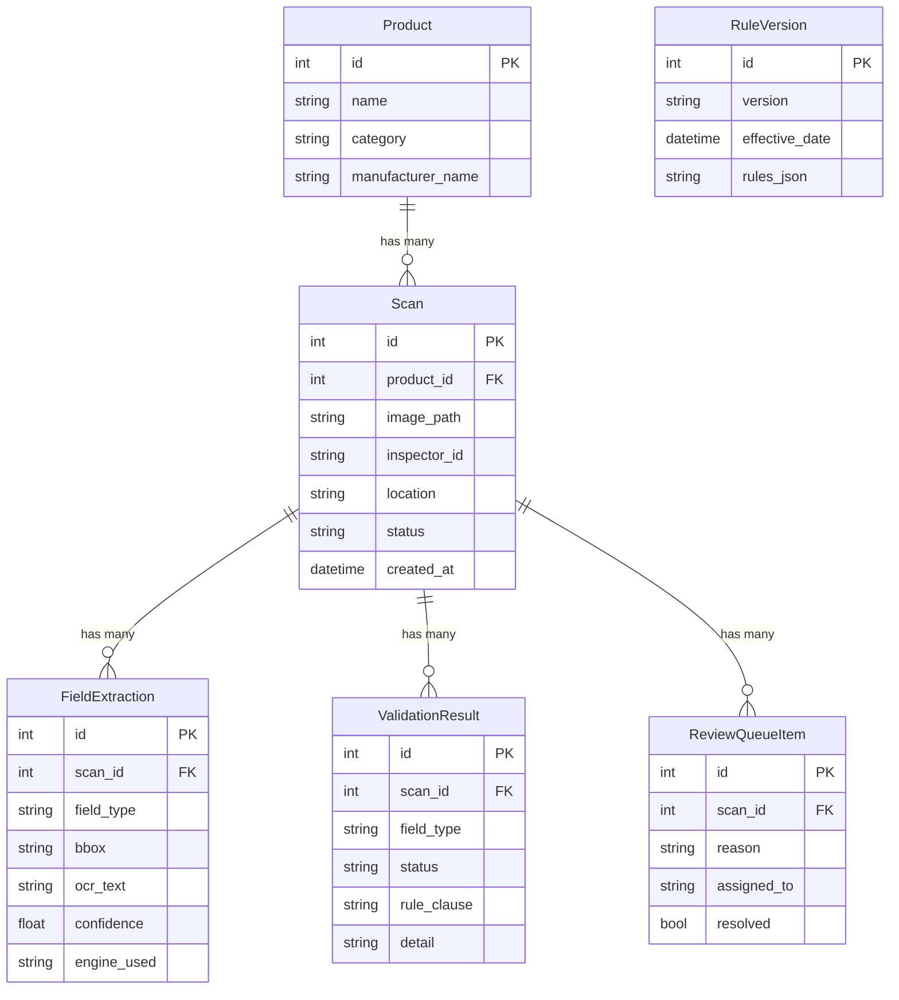

# LMPC Inspector — System Architecture

## High-Level Directory Layout

```
SIH/
├── backend/                  # Python FastAPI application
│   └── app/
│       ├── main.py           # ASGI entry point, CORS, router mounting
│       ├── api/
│       │   └── scans.py      # REST endpoints: upload, review queue, PDF report
│       ├── db/
│       │   ├── database.py   # SQLAlchemy engine, session factory, get_db()
│       │   └── models.py     # ORM models (Product, Scan, FieldExtraction, etc.)
│       ├── ocr/
│       │   ├── pipeline.py   # EasyOCR extraction + docTR crop verification
│       │   └── classifier.py # Regex-based field type classification
│       ├── rules/
│       │   └── engine.py     # Spatial scoring rule evaluators + orchestrator
│       ├── templates/
│       │   └── report.html   # Jinja2 PDF report template
│       ├── core/             # (empty — reserved for config/settings)
│       ├── services/         # (empty — reserved for business logic services)
│       └── tests/            # (empty — reserved for unit tests)
├── frontend/
│   └── index.html            # React 18 SPA (CDN-loaded, no build step)
├── storage/                  # Uploaded images, preprocessed copies, SQLite DB
├── data/                     # (empty — reserved for training data / datasets)
├── gemini.md                 # AI agent system instructions
├── rules.md                  # Coding standards & constraints
├── architecture.md           # This file
├── history.md                # Decision log & changelog
└── continuation.md           # Hand-off state for next session
```

## Component Dependency Graph

```mermaid
graph TD
    FE["Frontend<br/>index.html"] -->|HTTP POST /upload| API["API Layer<br/>scans.py"]
    FE -->|GET /review-queue| API
    FE -->|GET /{id}/report| API

    API -->|"get_db()"| DB["Database<br/>database.py + models.py"]
    API -->|"run_ocr_pipeline()"| OCR["OCR Pipeline<br/>pipeline.py"]
    API -->|"classify_fields()"| CLS["Classifier<br/>classifier.py"]
    API -->|"run_rule_engine()"| RE["Rule Engine<br/>engine.py"]

    OCR -->|"EasyOCR"| IMG["Image<br/>storage/"]
    RE -->|"verify_with_doctr()"| OCR
    RE -->|reads| CLS

    API -->|"Jinja2 + xhtml2pdf"| PDF["PDF Generator<br/>report.html"]
```

## End-to-End Data Flow

```
┌──────────┐     ┌─────────────┐     ┌───────────────┐     ┌─────────────┐
│ Inspector│────▶│ POST /upload │────▶│ Save image to │────▶│ Create Scan │
│ (Camera) │     │  (FormData)  │     │   storage/    │     │  record (DB)│
└──────────┘     └─────────────┘     └───────────────┘     └──────┬──────┘
                                                                   │
                                          ┌────────────────────────▼────┐
                                          │  run_ocr_pipeline(image)    │
                                          │  ┌─────────────────────┐    │
                                          │  │ 1. CLAHE preprocess │    │
                                          │  │ 2. EasyOCR readtext │    │
                                          │  │ 3. Return regions[] │    │
                                          │  └─────────────────────┘    │
                                          └────────────┬────────────────┘
                                                       │
                                          ┌────────────▼────────────────┐
                                          │   classify_fields(regions)  │
                                          │  ┌─────────────────────┐    │
                                          │  │ Regex match → MRP   │    │
                                          │  │ Regex match → NetQty│    │
                                          │  └─────────────────────┘    │
                                          └────────────┬────────────────┘
                                                       │
                                          ┌────────────▼────────────────┐
                                          │  run_rule_engine(fields,    │
                                          │    regions, image_path)     │
                                          │  ┌─────────────────────┐    │
                                          │  │ evaluate_mrp_rule() │    │
                                          │  │  • 2D spatial search│    │
                                          │  │  • Bad-number blackl│    │
                                          │  │  • Candidate scoring│    │
                                          │  │  • docTR verify     │    │
                                          │  ├─────────────────────┤    │
                                          │  │ evaluate_net_qty()  │    │
                                          │  │  • Unit-aware search│    │
                                          │  │  • Line clustering  │    │
                                          │  │  • Unit normalise   │    │
                                          │  └─────────────────────┘    │
                                          └────────────┬────────────────┘
                                                       │
                              ┌─────────────────────────▼──────────────────┐
                              │  Save extractions + validations to DB      │
                              │  Route uncertain → ReviewQueueItem         │
                              │  Set scan.status = passed|failed|needs_rev │
                              └─────────────────────────┬──────────────────┘
                                                        │
                                               ┌───────▼───────┐
                                               │ Return JSON   │
                                               │ ScanResponse  │
                                               └───────────────┘
```

## Database Schema (ER Diagram)


